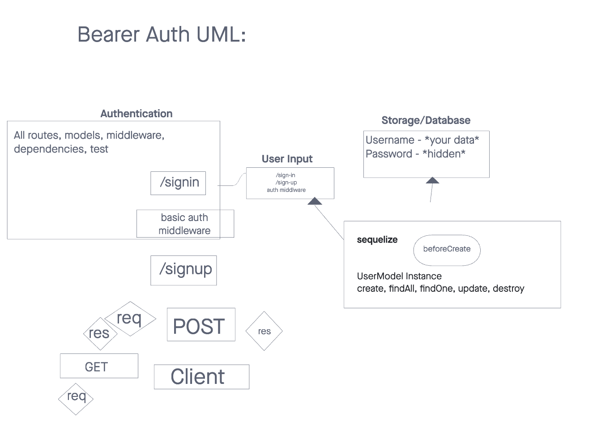

# LAB - 07

## Project: Bearer Auth

### Author: Kenya Womack

### Problem Domain

In this phase, the new requirement is that any user that has successfully logged in using basic authentication (username and password) is able to continuously authenticate … using a “token”

### Links and Resources

- [GitHub Actions ci/cd](https://github.com/KenyaWomack/api-server/actions)
- [back-end prod server url](https://basic-express-server-syft.onrender.com/)

### Collaborators

- Coriana Williams

### Setup

#### `.env` requirements (where applicable)

Using only PORT which can be found on `.env.sample`

#### How to initialize/run your application (where applicable)

Clone repo, `npm i`, then run `nodemon` in the terminal

#### Routes

- GET : `/` - specific route to hit

#### Tests

To run tests, after running `npm i`, run the command `npm test`.

#### UML

